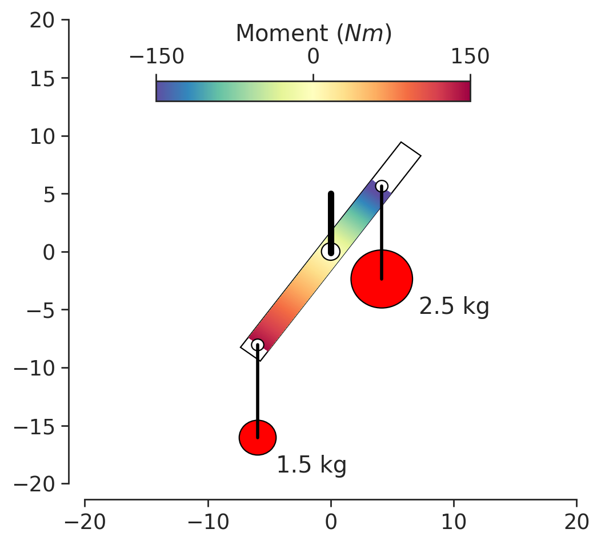

# Beam balance
This is an attempt to simulate the beam balance of a *dishonest* merchant where he sneakily suspends the reference weight close to the pivot. This creates the illusion that the weighed items seem much heavier than they really are!

  

See my video explanation on this (in नेपाली language, but the English explanation is down below): 
- [TikTok](https://www.tiktok.com/@cosmicoryx/video/7362549753755847968)
- [Reels](https://facebook.com/share/v/6WJQ1hjiBMCAzVt5)

Please click this jupyter notebook (.ipynb) file [beam_balance](/beam_balance.ipynb) to see the code.

The analysis of this situation is strightforward. Just write the kinetic and potential energy to get the Lagrangian. Then, use Euler-Lagrange equation to get the equation of motion of the system. Since, the only degree of freedom of this system is the angle made by the beam balance (θ) and is the generalised coordinate, the resulting equation of motion is a second-order differential equation of θ. 

Strictly speaking, we should be adding non-conservative forces in the Euler-Lagrange equation (Rayleigh dissipation function), but `euler_equations` from `sympy.calculus.euler` apparently does not allow that (or maybe I don't know). Instead, I added non-conservative forces manually later on. 

The animation of the beam balance is in this video. 

https://github.com/CosmicOryx/beam-balance/raw/main/anim_with_moment.mp4

2.5 kg is placed closer (7 cm) from the pivot and 1.5 kg is placed at 10 cm from the pivot. The mass 1.5 kg sags down and appears much heaver that 2.5 kg!
